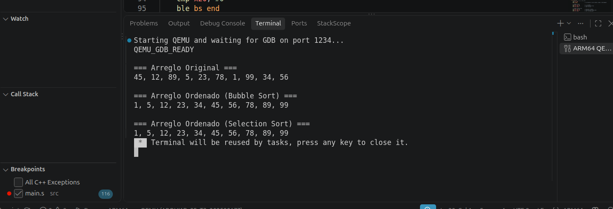
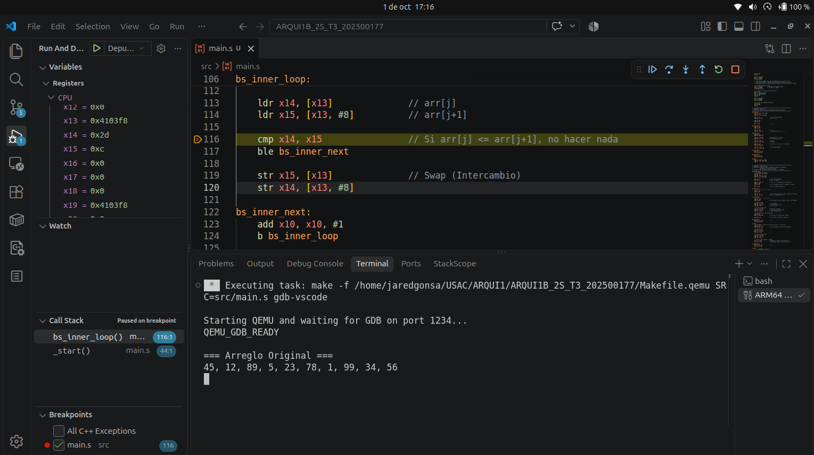

# Algoritmos de Ordenamiento en ARM64 (Tarea 3)

## Descripción
Este proyecto contiene la implementación de los algoritmos clásicos de ordenamiento **Bubble Sort** y **Selection Sort** desarrollados completamente en lenguaje ensamblador ARM64 puro. El programa procesa un arreglo de 10 enteros de 64 bits en memoria y los ordena de forma *in-place*.

El diseño destaca por una arquitectura modular, donde cada algoritmo de ordenamiento funciona como una subrutina independiente con su propio manejo estricto del *stack frame*, garantizando la preservación de los registros *callee-saved* según el estándar de llamadas de ARM.

## Estructura del Repositorio
- `src/main.s`: Archivo principal que contiene la declaración de los datos en memoria, la lógica de impresión y los ciclos anidados de los algoritmos de ordenamiento.
- `src/06_itoa.s`: Subrutina externa de utilidad para la conversión de números enteros a cadenas de texto ASCII.
- `Makefile.qemu` / `Makefile.arm64`: Scripts de automatización para ensamblado, enlazado y depuración del proyecto.
- `screenshots/`: Directorio destinado al almacenamiento de las evidencias de funcionamiento.

## Evidencias de Ejecución y Depuración

### 1. Salida en Consola
El programa imprime el arreglo en su estado desordenado original y, posteriormente, muestra el resultado exacto en memoria tras la aplicación aislada de Bubble Sort y Selection Sort.



### 2. Depuración con GDB
La siguiente captura demuestra una sesión de depuración interactiva utilizando GDB conectado a través del emulador QEMU. Se estableció un *breakpoint* dentro del ciclo interno de ordenamiento para inspeccionar los registros de propósito general y el flujo lógico de las instrucciones de comparación.



## Instrucciones de Uso
Para compilar y ejecutar en un entorno Linux x86_64 utilizando el emulador QEMU, ejecute:

```bash
make -f Makefile.qemu run

```

Para iniciar el servidor de depuración y conectar la interfaz gráfica de GDB en VS Code:

```bash
make -f Makefile.qemu gdb-vscode

```
